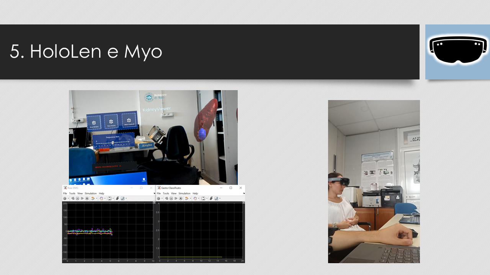

# Abstract
Il progetto, dalla durata complessiva di 3 mesi, ha previsto lo sviluppo di un'applicazione per __realtà aumentata__ che riesce a mostrare, tramite __HoloLens__, la riproduzione della parte anatomica oggetto dell'operazione. Il software sviluppato consente di effettuare azioni all'interno dell'interfaccia mediante l'utilizzo del __Myo__, un dispositivo in grado di registrare l'__EMG__ dell'avambraccio. Durante il progetto sono state sviluppate complessivamente 2 reti neurali: la prima, in grado di segmentare i reni all'interno di una TC, è stata addestrata partendo da un dataset della Challenge Kits 2021; la seconda, è stata addestrata per associare ai segnali EMG, le azioni da compiere durante l'utilizzo del software in HoloLens. 
Il sistema per l'acquisizione e l'elaborazione dei dati del Myo è un sistema __Real-Time__ sviluppato in Simulink con utilizzo del protocollo __UDP__ per l'invio di dati al visore VR

# Technologies
  

# Preview

# Brief Project explanation

